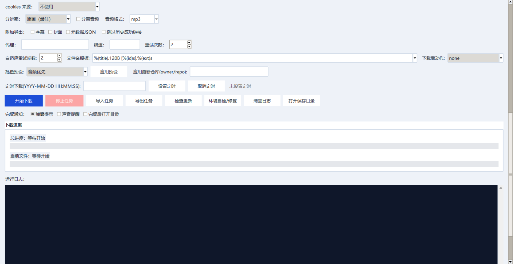

# 🎬 BillBill Downloader

<p align="center">
  <a href="#english">English</a> | <a href="#中文">中文</a>
</p>

---

<div id="english"></div>

## English

A powerful Windows desktop/CLI tool for batch downloading videos from **Bilibili** and **Douyin** (public videos you have legal access to).

### ✨ Features

| Category | Feature |
|---|---|
| **Platform Support** | Auto-detect Bilibili/Douyin URLs, mixed links batch processing |
| **Pre-download Preview** | Display title, author, duration before downloading; checkbox selection |
| **Embedded Player** | Real-time preview with python-vlc + VLC (no external player needed) |
| **Multi-P Selection** | Bilibili playlists and multi-P videos support individual P selection |
| **Safe Cancellation** | GUI tasks can be safely stopped via threading.Event soft interrupt |
| **Progress Tracking** | Real-time progress bar with speed and ETA |
| **Audio Extraction** | Extract audio to mp3/m4a/wav/flac formats |
| **Metadata Export** | Export subtitles (srt/ass), thumbnails, and metadata JSON |
| **Download History** | History tracking with duplicate URL auto-skipping |
| **Batch Import/Export** | Import/export tasks via txt/csv/json |
| **Network Config** | HTTP/SOCKS proxy, rate limit, retry settings |
| **Generic Web** | Playwright + ffmpeg for non-Bilibili/Douyin video pages |
| **Self-Repair** | One-click environment check and auto-fix |

### 📸 Screenshots

**Main Interface**


**Settings Panel**


### 🏗 Architecture

```
BillBill Downloader
├── GUI Layer (tkinter + ttkbootstrap)
│   ├── Pre-download preview panel
│   ├── Real-time embedded VLC player
│   ├── Progress & speed display
│   └── Settings persistence
├── Download Engine (yt-dlp + Playwright)
│   ├── Platform auto-detection
│   ├── Cookie injection
│   ├── Resolution selection
│   └── Audio/subtitle extraction
└── Packaging (PyInstaller)
    └── Standalone EXE output
```

### 🚀 Quick Start

#### GUI Mode (Recommended)
```powershell
# Method 1: Run directly
python bilibili_gui.py

# Method 2: Double-click the launcher
start_app.bat
```

#### CLI Mode
```powershell
# Single video
python bilibili_downloader.py --platform auto --resolution 1080 "https://www.bilibili.com/video/BVxxxxxxxxxx"

# Audio only
python bilibili_downloader.py --platform auto --extract-audio --audio-format mp3 "https://v.douyin.com/AbCdEfG/"

# With all metadata
python bilibili_downloader.py --platform auto --write-subs --write-thumbnail --write-info-json --proxy "http://127.0.0.1:7890" --rate-limit 2M --retries 2
```

#### Build Standalone EXE
```powershell
.\build_exe.bat
# Output: .\dist\BillBillDownloader_CN.exe
```

### 📦 Project Structure

```
bilibili-downloader/
├── bilibili_downloader.py   # Core CLI downloader engine
├── bilibili_gui.py          # GUI application (tkinter)
├── gui_utils.py             # GUI helper utilities
├── runtime_env.py           # Environment detection & repair
├── web_downloader.py        # Generic webpage video download
├── web_sniffer.py           # Playwright media request sniffer
├── requirements.txt         # Python dependencies
├── build_exe.bat            # PyInstaller build script
└── README.md
```

### 🛠 Tech Stack

| Technology | Purpose |
|---|---|
| Python 3.10+ | Core language |
| yt-dlp | Video download engine |
| Playwright | Web page media sniffing |
| python-vlc | Embedded video preview |
| ttkbootstrap | Modern GUI theming |
| PyInstaller | Standalone EXE packaging |

### 📋 Requirements

```powershell
pip install -r requirements.txt
# For generic web download, also install:
playwright install chromium
```

### 🔮 Roadmap

- [ ] Multi-threaded concurrent downloads
- [ ] Cloud sync for download history
- [ ] Plugin system for custom platforms
- [ ] Cross-platform support (macOS/Linux)

---

<div id="中文"></div>

## 中文

一款强大的 Windows 桌面/命令行工具，用于批量下载 **B站（哔哩哔哩）** 和 **抖音** 视频（仅限您有合法访问权限的公开内容）。

### ✨ 功能特性

| 类别 | 功能 |
|---|---|
| **平台支持** | 自动识别 B站/抖音 URL，支持混合链接批量处理 |
| **下载前预览** | 下载前展示标题、作者、时长，支持勾选选择 |
| **内嵌播放器** | 集成 python-vlc + VLC，无需外部播放器即可实时预览 |
| **多P选择** | B站合集、多P 视频支持按 P 勾选下载 |
| **安全取消** | GUI 下载任务可通过 threading.Event 软中断安全停止 |
| **进度追踪** | 实时进度条，显示下载速度和预计完成时间 |
| **音频分离** | 支持提取音频为 mp3/m4a/wav/flac 格式 |
| **元数据导出** | 导出字幕（srt/ass）、封面、元数据 JSON |
| **下载历史** | 历史记录追踪，重复 URL 自动跳过 |
| **任务导入导出** | 通过 txt/csv/json 批量导入/导出下载任务 |
| **网络配置** | 支持 HTTP/SOCKS 代理、限速、重试设置 |
| **通用网页** | 基于 Playwright + ffmpeg 下载任意网页视频 |
| **一键修复** | 环境自检与一键修复功能 |

### 🏗 架构

```
BillBill Downloader
├── GUI 层 (tkinter + ttkbootstrap)
│   ├── 下载前预览面板
│   ├── 内嵌 VLC 实时播放器
│   ├── 进度与速度显示
│   └── 配置持久化
├── 下载引擎 (yt-dlp + Playwright)
│   ├── 平台自动识别
│   ├── Cookie 注入
│   ├── 分辨率选择
│   └── 音频/字幕提取
└── 打包 (PyInstaller)
    └── 独立 EXE 输出
```

### 🚀 快速开始

#### GUI 模式（推荐）
```powershell
# 方式一：直接运行
python bilibili_gui.py

# 方式二：双击启动脚本
start_app.bat
```

#### CLI 模式
```powershell
# 单个视频
python bilibili_downloader.py --platform auto --resolution 1080 "https://www.bilibili.com/video/BVxxxxxxxxxx"

# 仅下载音频
python bilibili_downloader.py --platform auto --extract-audio --audio-format mp3 "https://v.douyin.com/AbCdEfG/"

# 带全部元数据
python bilibili_downloader.py --platform auto --write-subs --write-thumbnail --write-info-json --proxy "http://127.0.0.1:7890" --rate-limit 2M --retries 2
```

#### 打包为独立 EXE
```powershell
.\build_exe.bat
# 输出路径: .\dist\BillBillDownloader_CN.exe
```

### 📦 项目结构

```
bilibili-downloader/
├── bilibili_downloader.py   # 核心 CLI 下载引擎
├── bilibili_gui.py          # GUI 应用 (tkinter)
├── gui_utils.py             # GUI 工具函数
├── runtime_env.py           # 环境检测与修复
├── web_downloader.py        # 通用网页视频下载
├── web_sniffer.py           # Playwright 媒体请求嗅探
├── requirements.txt         # Python 依赖
├── build_exe.bat            # PyInstaller 打包脚本
└── README.md
```

### 🛠 技术栈

| 技术 | 用途 |
|---|---|
| Python 3.10+ | 核心语言 |
| yt-dlp | 视频下载引擎 |
| Playwright | 网页媒体嗅探 |
| python-vlc | 内嵌视频预览 |
| ttkbootstrap | 现代 GUI 主题 |
| PyInstaller | 独立 EXE 打包 |

### 📋 环境要求

```powershell
pip install -r requirements.txt
# 如需通用网页下载，还需安装：
playwright install chromium
```

### 🔮 未来规划

- [ ] 多线程并发下载
- [ ] 下载历史云端同步
- [ ] 自定义平台插件系统
- [ ] 跨平台支持（macOS/Linux）

---

## License

MIT
